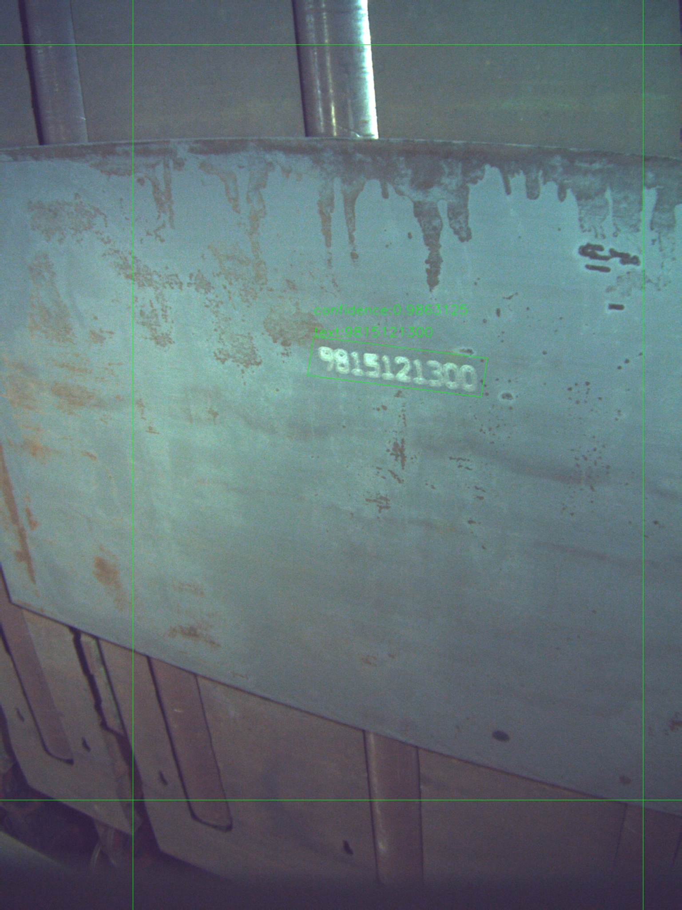
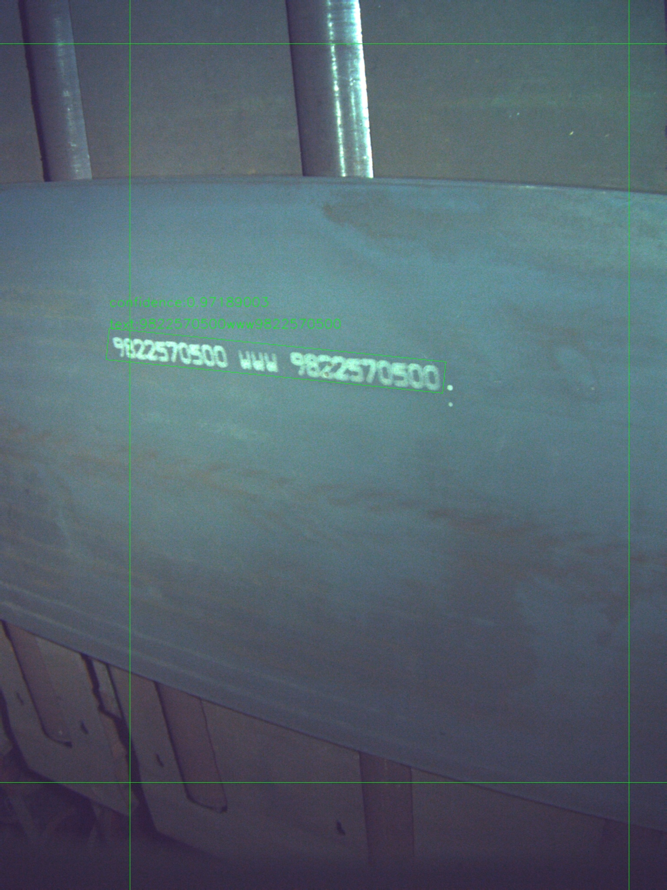
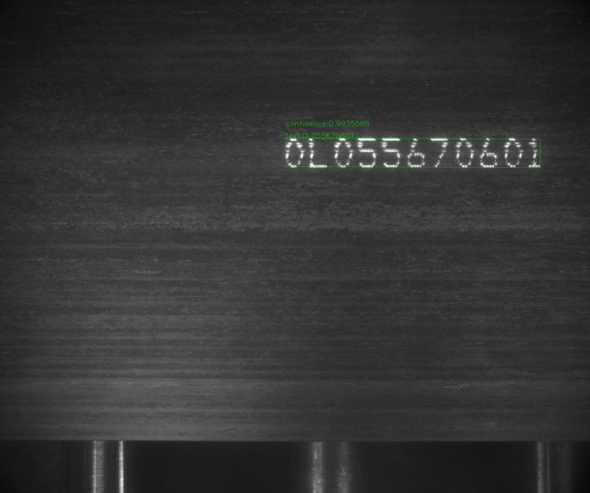
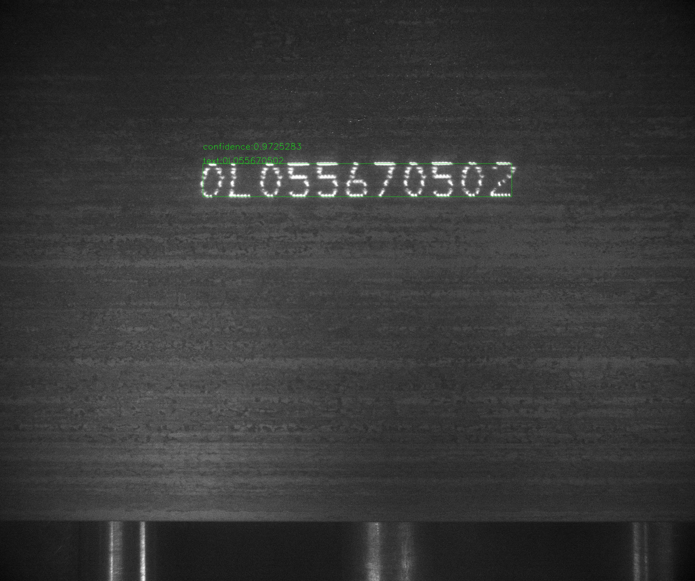

English | [简体中文](README_ch.md)
# Steel Billet Character Recognition，SBCR

## Description
Steel Billet Character Recognition

## Overall directory structure
The overall directory structure of SBCR(Steel Billet Character Recognition) is introduced as follows:

Steel-Billet-Character-Recognition   
├── [Xiang-Steel-Billet-Dataset](https://github.com/YukSing12/Steel-Billet-Dataset)    (Not open source yet)   
├── [Tangshan-Steel-Billet-Dataset](https://github.com/YukSing12/Tangshan-Steel-Billet-Dataset)    (Not open source yet)   
├── [PaddleOCR](https://github.com/PaddlePaddle/PaddleOCR)    
├── [PaddleSlim](https://github.com/PaddlePaddle/PaddleSlim)   
├── predict.py   
└── results    

## Todo list    

- [x] Model selection   
  - [x] Detection: DB([paper](https://arxiv.org/abs/1911.08947))   
  - [x] Recognition: CRNN([paper](https://arxiv.org/abs/1507.05717))   
- [x] Model retraining     
- [ ] Model optimization   
  - [ ] Model compression    
  - [ ] Model quantization    
- [ ] Model deployment    
  - [ ] C++ Inference
  - [ ] TensorRT Acceleration

## Installation   

### Requirements:
- Python 2.7/3.5/3.6/3.7/3.8 (3.7.4 is recommended)
- CUDA 9/10.0/10.1 
- PaddleOCR-develop
- PaddleSlim-develop
- PaddlePaddle-2.0rc

### Installation:

#### Create conda environment
```bash   
  conda create -n SBCR python=3.7.4
  conda activate SBCR
```

#### Install PaddlePaddle with CUDA 10.0  [(more version)](https://www.paddlepaddle.org.cn/install/quick):
```bash
  conda install paddlepaddle-gpu==2.0.0rc0 cudatoolkit=10.0 -c paddle
 ```
#### Check installation of paddle
```bash
  CUDA_VISIBLE_DEVICES=0 python ./run_check.py
```
#### If installed successfully, it will show that
```bash
  Your Paddle Fluid works well on SINGLE GPU or CPU.
  Your Paddle Fluid works well on MUTIPLE GPU or CPU.
  Your Paddle Fluid is installed successfully! Let's start deep Learning with Paddle Fluid now
```

#### Clone Repo
```bash
  git clone https://github.com/YukSing12/Steel-Billet-Character-Recognition.git
  cd Steel-Billet-Character-Recognition/
```

#### Install PaddleOCR-develop from [repo](https://github.com/PaddlePaddle/PaddleOCR)
```bash
  git clone https://github.com/PaddlePaddle/PaddleOCR.git
```

#### Install paddleocr
```bash
  cd PaddleOCR/
  pip install -r requirements.txt -i https://mirror.baidu.com/pypi/simple
  python setup.py install
```

#### Clone PaddleSlim-develop from [repo](https://github.com/PaddlePaddle/PaddleSlim)
```bash
  git clone https://github.com/PaddlePaddle/PaddleSlim.git
```

#### Install paddleslim
```bash
  cd PaddleSlim/
  pip install -r requirements.txt -i https://mirror.baidu.com/pypi/simple
  python setup.py install
```

## Dataset

### Xiang-Steel-Billet-Dataset
<div align="center">
    
    
</div>

### Tangshan-Steel-Billet-Dataset    
<div align="center">
    
    
</div>
