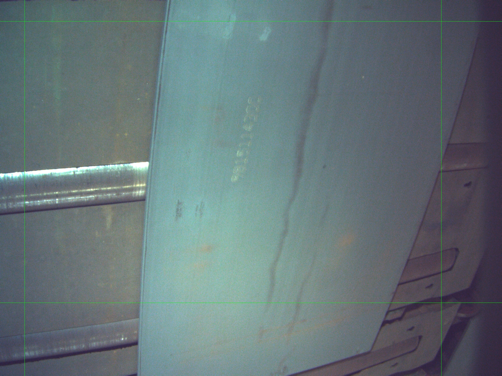
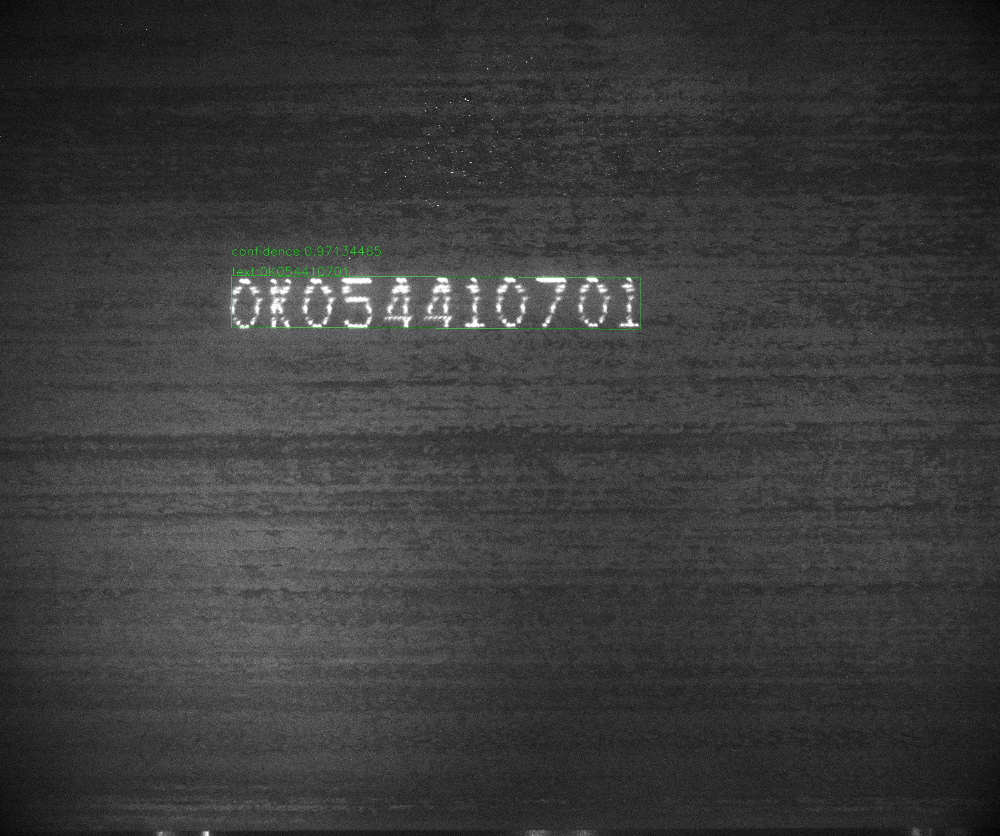

[English](README.md) | 简体中文
# 钢胚字符识别，SBCR

## 介绍
钢胚字符识别

## 整体目录结构
Steel-Billet-Character-Recognition 的整体目录结构介绍如下：

Steel-Billet-Character-Recognition   
├── [Xiang-Steel-Billet-Dataset](https://github.com/YukSing12/Xiang-Steel-Billet-Dataset)    (尚未开源)   
├── [Tangshan-Steel-Billet-Dataset](https://github.com/YukSing12/Tangshan-Steel-Billet-Dataset)    (尚未开源)   
├── [PaddleOCR](https://github.com/PaddlePaddle/PaddleOCR)    
├── [PaddleSlim](https://github.com/PaddlePaddle/PaddleSlim)    
├── predict.py   
└── results  

## 待办    

- [x] 模型选择   
  - [x] 检测：DB([paper](https://arxiv.org/abs/1911.08947))
  - [x] 识别：CRNN([paper](https://arxiv.org/abs/1507.05717))
- [x] 模型训练     
- [ ] 模型优化   
  - [ ] 模型压缩    
  - [ ] 模型量化    
- [ ] 模型部署   

## 安装   

### 依赖项:
- Python 2.7/3.5/3.6/3.7/3.8 (3.7.4 is recommended)
- CUDA 9/10.0/10.1 
- PaddleOCR-develop
- PaddleSlim-develop
- PaddlePaddle-2.0rc

### 安装 [(更多版本)](https://www.paddlepaddle.org.cn/install/quick):
```bash
  # Create conda environment

  conda create -n SBCR python=3.7.4
  conda activate SBCR

  # Install PaddlePaddle with 10.0
  conda install paddlepaddle-gpu==2.0.0rc0 cudatoolkit=10.0 -c paddle
  
  # Check installation of paddle
  CUDA_VISIBLE_DEVICES=0 python ./run_check.py
  
  # If installed successfully, it will show that
  # Your Paddle Fluid works well on SINGLE GPU or CPU.
  # Your Paddle Fluid works well on MUTIPLE GPU or CPU.
  # Your Paddle Fluid is installed successfully! Let's start deep Learning with Paddle Fluid now

  # Clone repo
  git clone https://github.com/YukSing12/Steel-Billet-Character-Recognition.git
  cd Steel-Billet-Character-Recognition/
  
  # Clone PaddleOCR
  git clone https://github.com/PaddlePaddle/PaddleOCR.git
  # Install paddleocr
  cd PaddleOCR/
  python setup.py install
  
  # Clone PaddleSlim
  git clone https://github.com/PaddlePaddle/PaddleSlim.git
  # Install paddleslim
  cd PaddleSlim/
  python setup.py install

```
## 数据集
### 湘钢数据集   
<div align="center">
    
</div>

### 唐钢数据集       
<div align="center">
    
    
</div>
