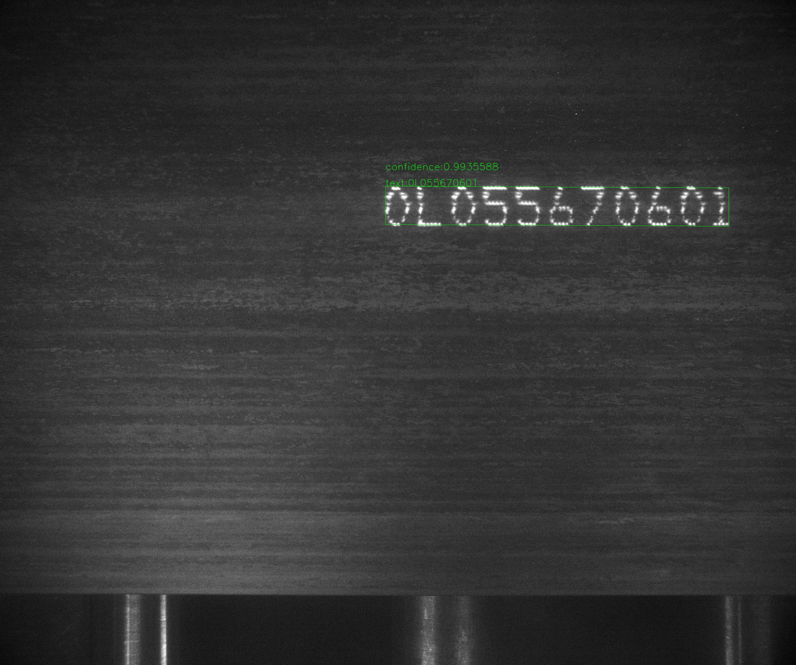

[English](README.md) | 简体中文
# 钢胚字符识别，SBCR

## 介绍
钢胚字符识别

## 整体目录结构
Steel-Billet-Character-Recognition 的整体目录结构介绍如下：

Steel-Billet-Character-Recognition   
├── [Xiang-Steel-Billet-Dataset](https://github.com/YukSing12/Xiang-Steel-Billet-Dataset)    (尚未开源)   
├── [Tangshan-Steel-Billet-Dataset](https://github.com/YukSing12/Tangshan-Steel-Billet-Dataset)    (尚未开源)   
├── [PaddleOCR](https://github.com/PaddlePaddle/PaddleOCR)    
├── [PaddleSlim](https://github.com/PaddlePaddle/PaddleSlim)    
├── predict.py   
└── results  

## 待办    

- [x] 模型选择   
  - [x] 检测：DB([paper](https://arxiv.org/abs/1911.08947))
  - [x] 识别：CRNN([paper](https://arxiv.org/abs/1507.05717))
- [x] 模型训练     
- [ ] 模型优化   
  - [ ] 模型压缩    
  - [ ] 模型量化    
- [ ] 模型部署
  - [ ] C++ 预测
  - [ ] TensorRT 加速

## 安装   

### 依赖项:
- Python 2.7/3.5/3.6/3.7/3.8 (3.7.4 is recommended)
- CUDA 9/10.0/10.1 
- PaddleOCR-develop
- PaddleSlim-develop
- PaddlePaddle-2.0rc

### 安装:

#### 创建conda环境
```bash   
  conda create -n SBCR python=3.7.4
  conda activate SBCR
```

#### 安装CUDA 10.0的Paddlepaddle  [(更多版本)](https://www.paddlepaddle.org.cn/install/quick):
```bash
  conda install paddlepaddle-gpu==2.0.0rc0 cudatoolkit=10.0 -c paddle
 ```
#### 检查paddlepaddle的安装
```bash
  CUDA_VISIBLE_DEVICES=0 python ./run_check.py
```
#### 如果安装成功，则显示
```bash
  Your Paddle Fluid works well on SINGLE GPU or CPU.
  Your Paddle Fluid works well on MUTIPLE GPU or CPU.
  Your Paddle Fluid is installed successfully! Let's start deep Learning with Paddle Fluid now
```

#### 克隆 Repo
```bash
  git clone https://github.com/YukSing12/Steel-Billet-Character-Recognition.git
  cd Steel-Billet-Character-Recognition/
```

#### 克隆 [PaddleOCR-develop](https://github.com/PaddlePaddle/PaddleOCR)
```bash
  git clone https://github.com/PaddlePaddle/PaddleOCR.git
```

#### 安装 paddleocr
```bash
  cd PaddleOCR/
  pip install -r requirements.txt -i https://mirror.baidu.com/pypi/simple
  python setup.py install
```

#### 克隆 [PaddleSlim-develop](https://github.com/PaddlePaddle/PaddleSlim)
```bash
  git clone https://github.com/PaddlePaddle/PaddleSlim.git
```

#### 安装 paddleslim
```bash
  cd PaddleSlim/
  pip install -r requirements.txt -i https://mirror.baidu.com/pypi/simple
  python setup.py install
```

## 数据集
### 湘钢数据集   
<div align="center">
    
</div>

### 唐钢数据集       
<div align="center">
    
    
</div>
